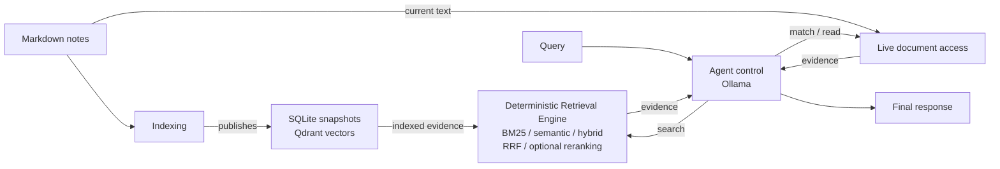

# ARKB

**Agentic Retrieval for Knowledge Bases** — an agentic knowledge retrieval system that separates dynamic agent control from deterministic retrieval over Markdown knowledge bases.

ARKB currently targets English notes and queries. UTF-8 text, source identities
and character ranges remain preserved. Active evaluation uses SciFact,
Bright-Pro technical domains and MuSiQue; earlier datasets and results are
retained for reference. See the [scope cleanup](docs/english-scope-cleanup.md).

## Why ARKB

A fixed RAG pipeline follows a predefined sequence:

```text
query -> retrieve -> assemble context -> generate
```

ARKB treats retrieval as an iterative process controlled by an agent:

```text
query -> reason -> match / search / read -> observe -> repeat -> respond
```

The agent decides what evidence to gather next and when to stop. It can refine queries, expand promising sources, switch retrieval strategies, and continue retrieving when more context is useful. Queries that require no retrieval can receive a direct response.

The responsibilities are intentionally separated:

- **Agent control** chooses tools, search modes, queries, and when to stop.
- **Retrieval execution** performs matching, ranking, fusion, and reranking. It does not plan or generate answers.

This distinction matters because knowledge-base queries are not always question-answering queries.

For example:

```text
"Which notes mention RAG?"
    -> exact lexical retrieval

"Find notes related to agent memory."
    -> semantic or hybrid retrieval

"Find material for an article about AI agents."
    -> iterative search, reading, and synthesis

"What is retrieval-augmented generation?"
    -> retrieval followed by generation
```

## Features

- Agent-controlled iterative retrieval with `match`, `search`, and `read`.
- Deterministic exact, BM25, semantic, and hybrid retrieval with optional reranking.
- Local Markdown indexing with section-aware chunking and reusable embeddings.
- Inspectable agent traces and bounded tool-calling loops.
- CLI with JSON output and reusable Python APIs.
- Retrieval baselines, agent evaluation, and controlled model ablations.

## Architecture



Indexing writes the persisted snapshots and vectors. Retrieval consumes them.

`Runtime` composes the agent, retrieval capabilities, knowledge access, and service clients. Direct `match` and `search` commands bypass the agent and expose deterministic retrieval behavior directly.

At a high level:

```text
Knowledge
    |
    v
Retrieval
    |
    +-------> Generation
    |
    +-------> Agent
                 |
                 +-------> Retrieval
                 +-------> Knowledge
                 +-------> Generation

Interfaces
    |
    v
 Runtime
```

Knowledge processing and retrieval remain independent from the agent. The agent acts as the control layer that dynamically composes those capabilities.

## Quick Start

### Requirements

- Python **3.13**
- [`uv`](https://docs.astral.sh/uv/)
- [`ripgrep`](https://github.com/BurntSushi/ripgrep) (`rg`)
- Ollama running at `http://127.0.0.1:11434`
- Qdrant Server running at `http://127.0.0.1:6333`

From the repository root:

```sh
uv sync --locked

ollama pull qwen3-embedding:0.6b
ollama pull qwen3.5:4b

uv run --locked arkb index --notes-dir example_notes
uv run --locked arkb status
```

The first index build downloads the pinned embedding tokenizer if it is not already cached.

Indexing uses section-aware, token-budgeted chunking, reuses compatible embeddings, and publishes a versioned snapshot after validation.

Recursive chunking now records algorithm `markdown-v2`. The next `arkb index`
publishes a new snapshot for an older chunking configuration while reusing
compatible embedding inputs; existing snapshots remain readable.

The default database is:

```text
.arkb/index.sqlite
```

The default vault ID is:

```text
default
```

Use `--host` and `--qdrant-url` to configure service endpoints, and `--db` and `--vault-id` to select index scope.

`--offline` prevents model-file and tokenizer downloads. Configured Ollama and Qdrant calls still occur.

To index your own notes, replace `example_notes` with your Markdown directory.

ARKB currently loads UTF-8 `.md` files directly inside the specified directory. It does not recursively traverse subdirectories.

When an index already exists, `match` and `ask` use its saved directory. An explicit `--notes-dir` must agree with that scope.

## Usage

ARKB exposes five top-level commands:

```text
match
search
ask
index
status
```

All commands support `--json`.

Inspect command-specific options with:

```sh
uv run --locked arkb <command> --help
```

### Exact lexical retrieval

Find notes that explicitly contain a term:

```sh
uv run --locked arkb match "RAG" \
  --notes-dir example_notes \
  --top-k 10
```

`match` searches live Markdown content through ripgrep.

It returns literal occurrences with source filenames and body character offsets.

It does not require an index, embedding model, Qdrant, or generation model.

`--top-k` limits occurrences, so multiple results may come from the same note.

### Semantic retrieval

Find knowledge related to a concept:

```sh
uv run --locked arkb search \
  "How can agents retain useful knowledge across sessions?" \
  --mode semantic \
  --top-k 5
```

### BM25 retrieval

Use lexical ranking when terminology matters:

```sh
uv run --locked arkb search \
  "agent memory" \
  --mode bm25
```

### Hybrid retrieval

Combine lexical and semantic candidates:

```sh
uv run --locked arkb search \
  "agent memory" \
  --mode hybrid \
  --top-k 5 \
  --json
```

`--source <filename.md>` restricts `match` or `search` to one exact source filename.

### Agentic multi-step retrieval

Let the agent decide which retrieval actions to perform:

```sh
uv run --locked arkb ask \
  "Find notes about agent memory, read relevant sections, and explain how memory persistence differs from context compaction." \
  --max-turns 8 \
  --trace
```

Illustrative `--trace` output:

```text
[1] search
query: "agent memory"
mode: "semantic"

[2] read
source: "34_agent_memory_lifecycle.md"

[3] search
query: "context compaction"
mode: "hybrid"

[4] final
```

The actual queries and tool choices depend on the model and evidence collected during the run.

The trace is written to stderr. The final response remains on stdout.

## Retrieval Engine

The retrieval engine is deterministic at the control-flow level and can be used independently from the agent.

| Method    | Purpose                              | Implementation                                                    |
| --------- | ------------------------------------ | ----------------------------------------------------------------- |
| Exact     | Exact occurrence discovery           | `ExactRetriever`, backed by ripgrep over live Markdown            |
| BM25      | Lexical relevance ranking            | In-memory ranking over title and body text from a SQLite snapshot |
| Semantic  | Conceptual similarity                | Ollama query embeddings with Qdrant vector search                 |
| Hybrid    | Sparse and dense candidate retrieval | BM25 and semantic candidates over the same snapshot               |
| Fusion    | Merge independent rankings           | Reciprocal Rank Fusion with stable identity-based tie breaking    |
| Reranking | Refine candidate ordering            | Optional `Qwen/Qwen3-Reranker-0.6B` scorer                        |

`RetrievalEngine.search` selects an explicit ranked retrieval mode:

```text
bm25
semantic
hybrid
```

`semantic` is the default.

Exact literal matching is intentionally exposed separately through `ExactRetriever` and the `match` command.

### Hybrid retrieval

Conceptually:

```text
                    Query
                      |
             +--------+--------+
             |                 |
            BM25            Semantic
             |                 |
             +--------+--------+
                      |
                     RRF
                      |
               optional rerank
                      |
                   Results
```

BM25 and semantic retrieval operate over the same indexed snapshot.

RRF combines the independent rankings before optional reranking.

### Reranking

Install the optional reranking dependencies:

```sh
uv sync --locked --extra rerank
```

Then run:

```sh
uv run --locked --extra rerank arkb search \
  "agent memory" \
  --mode hybrid \
  --rerank \
  --top-k 5
```

The current reranker uses the pinned `Qwen/Qwen3-Reranker-0.6B` model locally through PyTorch and Transformers.

### Exact text vs exact vector search

Literal text lookup uses:

```sh
arkb match
```

By contrast:

```sh
arkb search --exact
```

requests exact vector search in Qdrant.

These are different operations.

### Snapshot behavior

BM25 queries require no model or vector service once a compatible snapshot exists.

Semantic and hybrid queries require embeddings but do not generate answers.

Re-run:

```sh
arkb index
```

after editing indexed notes.

`search` operates over indexed content.

`match` and `read` operate over current files.

As a result, saved locations can become stale when files change after indexing.

`status` reports saved state but does not verify live freshness or external-service health.

ARKB uses `.arkb/` for local state, `ARKB_*` for project-specific environment variables, and `arkb_*` for generated Qdrant collections.

Storage and identity schemas are now version 2. Rebuild pre-v2 and retired NumPy indexes into a new database with `arkb index --notes-dir <notes-directory> --db <new-database-path>`.

Renaming a database or collection does not migrate its IDs or embedding-cache keys. Previous databases and Qdrant collections remain untouched; model files can still be reused.

## Agentic Retrieval

The agent loop exposes three retrieval actions:

| Tool     | Purpose                                                            |
| -------- | ------------------------------------------------------------------ |
| `match`  | Locate known words, phrases, symbols, or explicit patterns         |
| `search` | Discover ranked evidence using BM25, semantic, or hybrid retrieval |
| `read`   | Expand a promising source and inspect additional content           |

The loop repeatedly feeds tool observations back to Ollama until the model returns a final response.

Conceptually:

```text
User Query
    |
    v
  Agent
    |
    +------ match
    |
    +------ search
    |
    +------ read
    |
    v
Observation
    |
    v
  Agent
    |
    +------ gather more evidence
    |
    +------ reformulate query
    |
    +------ inspect another source
    |
    +------ stop
    |
    v
Final Response
```

The agent can select an available search mode on each `search` call.

`read` expands a source by document ID or filename and can optionally restrict the returned content to a section or character range.

Each `ask` invocation starts a fresh conversation while retaining one retrieval snapshot across turns.

Direct replies and live document operations can work without an index. Choosing `search` requires a published snapshot.

The default generation model is:

```text
qwen3.5:4b
```

Thinking is enabled by default.

Use:

```text
--generation-model
--think
--no-think
```

to modify generation behavior.

`--max-turns` defaults to eight model requests, including the final response.

If the turn budget is exhausted before a final response is produced, the command returns no final answer and exits with a nonzero status.

Model and tool failures propagate with available partial traces. The loop currently does not retry them automatically.

The default `ask` composition leaves reranking disabled. Prepared Python tools can configure reranking separately.

## Generation

The `generation/` package supports explicit generation workflows independently from the agent loop.

Its responsibilities include:

```text
retrieved evidence
        |
        v
context selection
        |
        v
token budgeting
        |
        v
generation
        |
        v
citation validation
```

The package provides context budgeting and validated citation APIs.

The current `ask` command returns the agent model's final text directly and does not apply the separate citation-validation stage from `generation/`.

This keeps agent execution and explicit citation-aware generation as separate capabilities.

## Evaluation

ARKB includes evaluation infrastructure for both deterministic retrieval and agent behavior.

The versioned dataset:

```text
evaluation/data/agent_v1.jsonl
```

contains 40 cases across:

- Exact lookup
- Semantic discovery
- Direct reading
- Exploratory retrieval
- Knowledge QA
- No-retrieval tasks

### Implemented evaluations

| Evaluation                | Measurements                                                                                                                   |
| ------------------------- | ------------------------------------------------------------------------------------------------------------------------------ |
| Fixed retrieval baselines | Source Recall@K, MRR, nDCG@K, latency, and errors                                                                              |
| Agent evaluation          | Task success, source recall, required reads, tool usage, turns, stopping behavior, and unnecessary retrieval                   |
| Model ablation            | Repeated trials across generation models, success consistency, latency, evidence gathering, provenance, and input-drift checks |

The fixed retrieval baselines are:

```text
bm25
semantic
hybrid
hybrid_rerank
```

### Run retrieval baselines

```sh
uv run --locked python -m arkb.evaluation.runs \
  --baselines bm25 semantic hybrid \
  --output evaluation/results/baseline-demo
```

To include `hybrid_rerank`, install the reranking extra and run through:

```sh
uv run --locked --extra rerank
```

### Run agent evaluation

```sh
uv run --locked python -m arkb.evaluation.runs \
  --num-trials 3 \
  --output evaluation/results/agent-demo
```

### Model ablation

The default model ablation compares:

```text
qwen3.5:4b
qwen3.5:9b
qwen3.5:27b
```

over three trials per case.

Check prerequisites with:

```sh
uv run --locked python -m arkb.evaluation.model_ablation \
  --check-only \
  --output evaluation/results/ablation-check
```

Run a smaller subset experiment with:

```sh
uv run --locked python -m arkb.evaluation.model_ablation \
  --phase smoke \
  --output evaluation/results/ablation-smoke
```

Omit both `--check-only` and `--phase smoke` for the formal experiment.

Each output directory must be new.

Evaluation runs preserve JSON, JSONL, and Markdown artifacts for later analysis.

Additional evaluation APIs cover:

- Exact vs ANN retrieval
- Frozen-candidate reranking
- Context coverage
- Citation validity

Agent success currently measures evidence gathering and tool behavior. It does not grade final-answer correctness.

Baseline rankings and accumulated agent evidence use different retrieval budgets and should be compared accordingly.

See:

- [Evaluation guide](evaluation/README.md)
- [Deterministic retrieval baseline guide](evaluation/deterministic-retrieval-baselines.md)
- [Agent model ablation guide](evaluation/agent-model-ablation.md)

## Project Structure

```text
src/arkb/
├── agent/        # Tool definitions, state, and bounded agent loop
├── knowledge/    # Markdown access, chunking, embeddings, indexing, persistence
├── retrieval/    # Exact, BM25, semantic, hybrid, fusion, and reranking
├── generation/   # Context construction, generation, and citation validation
├── evaluation/   # Datasets, metrics, baselines, agent runs, and ablations
├── interfaces/   # CLI and future external interfaces
├── config.py     # Runtime and retrieval configuration
└── runtime.py    # Capability composition and resource ownership
```

The main capability boundaries are:

```text
knowledge
retrieval
generation
agent
interfaces
evaluation
```

The design keeps deterministic knowledge processing and retrieval independent from agent control.

`tests/` mirrors the package capabilities at the top level.

`example_notes/` contains the sample Markdown corpus.

`evaluation/` and `benchmarks/` contain experiment inputs, configurations, and reports.

MCP support is planned; the repository does not yet expose an MCP server.

## Development

Install development dependencies:

```sh
uv sync --locked
```

Run the regular test suite:

```sh
uv run --locked python -m pytest -q -m "not integration"
```

These tests use local fixtures and mocked model services.

Exact matching tests require `rg` on `PATH`.

Real-model and external-service tests use the `integration` marker and explicit environment gates, including:

```text
ARKB_RUN_MODEL_TESTS
ARKB_QDRANT_URL
ARKB_RUN_RERANKER_TESTS
```

Capability-specific integration prerequisites are documented in the corresponding:

```text
tests/*/integration/
```

directories.

## Roadmap

Potential next steps:

- Recursive Markdown directory ingestion.
- A complete MCP server exposing the existing runtime capabilities.
- Final-answer quality evaluation alongside retrieval and agent behavior metrics.

These items are not currently implemented.

## License

Licensed under the [Apache License 2.0](LICENSE).
